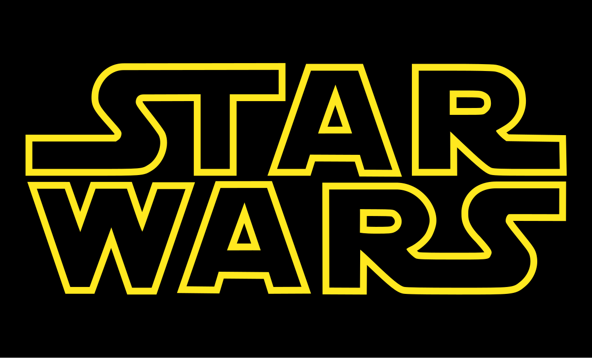

    <h2>🧑‍💻 Growing Every Day</h2>
    
데이터분석과 에듀테크에 관심이 많습니다!!

    

---

### ✏️ Currently Learning

    
    
    
    
    

---

### 🛠 Tech Stack

#### Languages

    
    
    

---

#### Frameworks / Libraries

    
    
    
    
    
    
    
    

---

#### Server

    

---

#### Office Applications

    

---

#### Tooling / DevOps

    
    
    
    
    
    

---

## 👀 Interests

- 📊 **Data Analysis**: 데이터를 전처리하여 분석하고 시각화하여 인사이트를 도출해내는 것에 관심이 많습니다. 교육 데이터를 활용한 머신러닝, 딥러닝 모델 구현에도 관심이 많고 데이터 관리에도 관심이 있습니다.
- 🎓 **EduTech**: 교육 분야에 관심이 많고 특히 교육과 AI 기술의 융합에 관심이 있습니다. 현재는 AI 교과서에 관심이 많습니다.
- ☁️ **AWS**: AWS 아키텍처를 구축해보고 데이터를 적재하여 실제 이론을 적용해보는 것에 관심이 있습니다. 효율적인 아키텍처 구축과 사용자에게 제공할 좋은 환경에 대해 고민하고 있습니다.
- 🗣️ **NLP**: 자연어 처리에 대해 공부 이를 교육 서비스에 이용할 아이디어에 대해 고민하고 있습니다.
- 🐍 **Python**: 파이썬의 모듈화와 클래스 및 함수 구현에 관심이 있습니다. 필요한 기능에 대해 구현해보려고 노력 중이고 이미 개발되어 있는 패키지의 구조에 대해 공부하고 있습니다.
- 🤖 **LLM (Large Language Models)**: LLM을 활용하여 서비스를 개발하는 프로젝트를 진행 중입니다. RAG를 통하여 영어 예문 생성 및 문법 개선 모델에 관심이 많습니다.

  
## 📂 Projects
- **프로젝트 이름 1**: [간단한 설명 추가]
- **프로젝트 이름 2**: [간단한 설명 추가]
- **프로젝트 이름 3**: [간단한 설명 추가]

## 🎸 Hobbies

> 🎶 **영화**와 **음악**을 사랑하는 사람입니다.

- 🎬 **Movies**: **스타워즈** 시리즈를 좋아합니다.  
  

- 🎸 **Music**: 공부를 하며 저의 스트레스를 해소해주는 친구들입니다. 특히 기타 치는 것을 좋아하고 지금도 간간히 연주하고 있습니다. 😊  
  

---

## 📊 GitHub Stats

  <!-- Most Used Languages in Donut Layout -->
      

  <!-- GitHub Stats -->
  

  <!-- GitHub Contribution Activity Graph -->
  

